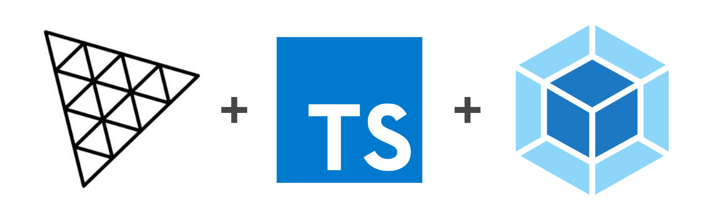
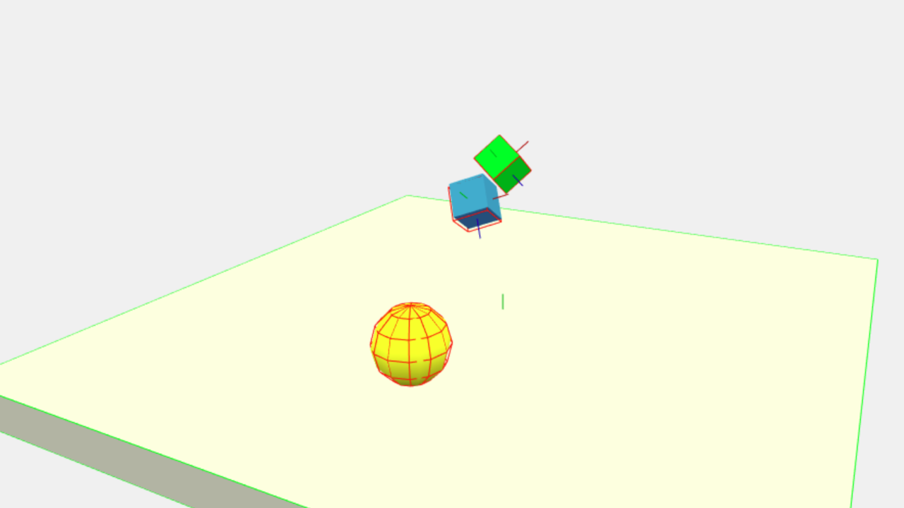

<h1 align="center">
  <br>
  <a href="https://github.com/yandeu/three-project-template#readme"></a>
  <br>
  Three.js TypeScript Starter Template
  <br>
</h1>

<h4 align="center">
A starter template for <a href="https://threejs.org/" target="_blank" >Three.js</a> with <a href="https://www.typescriptlang.org/index.html" target="_blank" >TypeScript</a> and <a href="https://webpack.js.org/" target="_blank" >webpack</a> for building excellent HTML5 3D Scenes that work great in the browser and on mobile devices.</h4>

<p align="center">
  <a href="https://david-dm.org/yandeu/three-project-template" title="dependencies status">
    
  </a>
  <a href="https://opensource.org/licenses/MIT" title="License: MIT" >
    
  </a>
  
  
  <a href="https://github.com/prettier/prettier" alt="code style: prettier"></a>
</p>

<p align="center">
  <a href="#key-features">Key Features</a> •
  <a href="#screenshot">Screenshot</a> •
  <a href="#how-to-use">How To Use</a> •
  <a href="#physics">Physics</a> •
  <a href="#react">React</a> •
  <a href="#progressive-web-app-pwa">PWA</a> •
  <a href="#native-app">Native App</a> •
  <a href="#custom-configurations">Custom Configurations</a> •
  <a href="#enable3d">enable3d</a> •
  <a href="#geckosio">geckos.io</a> •
  <a href="#license">License</a>
</p>

---

## Key Features

- **ESNext** features ready (async/await, Rest/Spread operators)
- Integrated Ammo Physics
- Code Splitting
- Obfuscation
- Development Server with SourceMap and Live-Reload
- PWA ready with offline support and "Add to Home screen" install prompt
- Easy to build Native App using Capacitor
- For development and production builds
- Adds a webpack ContentHash to the JavaScript files (in production)

## Screenshot



## How To Use

To clone and run this template, you'll need [Git](https://git-scm.com) and [Node.js](https://nodejs.org/en/download/) (which comes with [npm](http://npmjs.com)) installed on your computer. From your command line:

```bash
# Clone this repository
$ git clone --depth 1 https://github.com/yandeu/three-project-template.git three-scene

# Go into the repository
$ cd three-scene

# Install dependencies
$ npm install

# Start the local development server (on port 8080)
$ npm start

# Ready for production?
# Build the production ready code to the /dist folder
$ npm run build

# View your production ready 3D scene in the browser
$ npm run serve
```

Change the **projectName** in /webpack/webpack.common.js.

All your 3d scene code lies inside the **/src** folder. All assets need to be inside the **/src/assets** folder in order to get copied to /dist while creating the production build. Do not change the name of the index.html and index.ts files.

## Physics

This template include ammo.js ([@enable3d/ammo-physics](https://www.npmjs.com/package/@enable3d/ammo-physics)) physics by default.

## React

Want to use react? Simply add `"jsx": "react",` to [tsconfig.json](./tsconfig.json), then install and use react.

## Progressive Web App (PWA)


This template is **100% PWA ready**.

The ServiceWorker is **disabled by default**. Uncomment the line below inside /src/index.html to enable it.

```html
<script>
  if ('serviceWorker' in navigator) {
    window.addEventListener('load', () => {
      navigator.serviceWorker.register('./sw.js')
    })
  }
</script>
```

You can easily personalize its settings by following these steps:

- Replace both icons in /pwa/icons with your own.
  - One is **512x512** the other **192x192**
- Add your own **favicon.ico** to /src
- Adjust these parameters in the **manifest.json** file in /pwa
  - **short_name**: Max. 12 characters
  - **name**: The full name
  - **orientation**: "landscape" or "portrait"
  - **background_color**: color of the splash screen
  - **theme_color**: color of the navbar - has to match the theme-color in the index.html file
- You can leave the **sw.js** (serviceWorker) in /pwa how it is.
- Change the **projectName** in /webpack/webpack.common.js

Read more about PWA on [developers.google.com](https://developers.google.com/web/progressive-web-apps/)

## Native App

The simplest way to build a Native App is using [Capacitor](https://capacitor.ionicframework.com/) and following its [Documentation](https://capacitor.ionicframework.com/docs/).
The only thing you need to change after installing Capacitor is the **webDir** inside the **capacitor.config.json** file. Set it to **dist** like so:

```json
{
  "appId": "com.example.app",
  "appName": "YOUR_APP_NAME",
  "bundledWebRuntime": false,
  "webDir": "dist"
}
```

## Custom Configurations

### TypeScript Compiler

Change the TypeScript compiler's settings in the tsconfig.json file.

If you are new to TypeScript, you maybe want to set **"noImplicitAny"** to **false**.

You'll find more information about the TypeScript compiler [here](https://www.typescriptlang.org/docs/handbook/compiler-options.html).

### Typings

You can put your custom type definitions inside typings/**custom.d.ts**.

### Webpack

All webpack configs are in the **webpack** folder.

#### Obfuscation

We are using the [webpack-obfuscator](https://github.com/javascript-obfuscator/webpack-obfuscator). Change its settings in webpack/webpack.prod.js if needed. All available options are listed [here](https://github.com/javascript-obfuscator/javascript-obfuscator#javascript-obfuscator-options).

## enable3d

<a href="https://github.com/yandeu/enable3d#readme"></a>

Checkout [enable3d](https://enable3d.io), a awesome 3D framework I built (on top of three.js and ammo.js)!

## geckos.io

<a href="https://github.com/yandeu/enable3d#readme"></a>

Making a multiplayer game? Check out [geckos.io](http://geckos.io)

## License

The MIT License (MIT) 2020 - [Yannick Deubel](https://github.com/yandeu). Please have a look at the [LICENSE](LICENSE) for more details.
